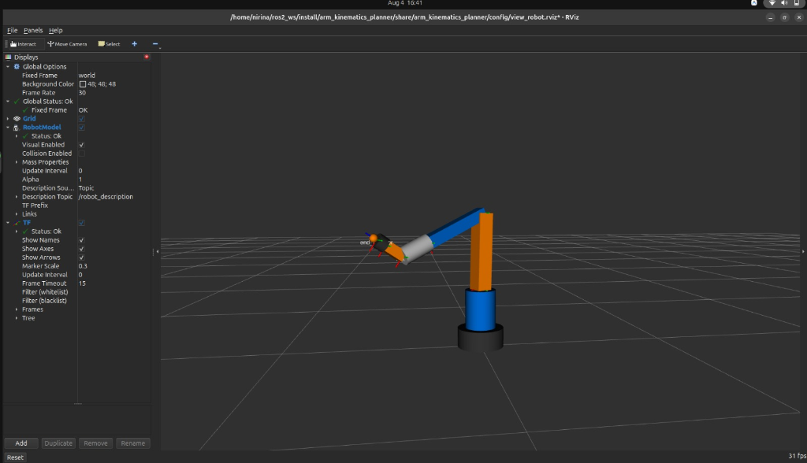
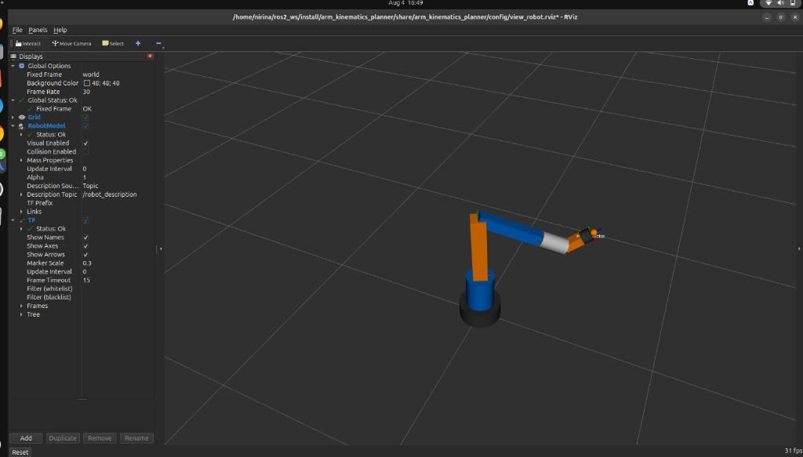
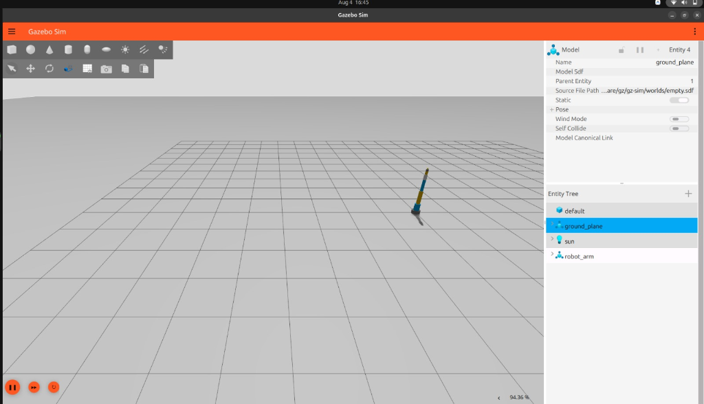
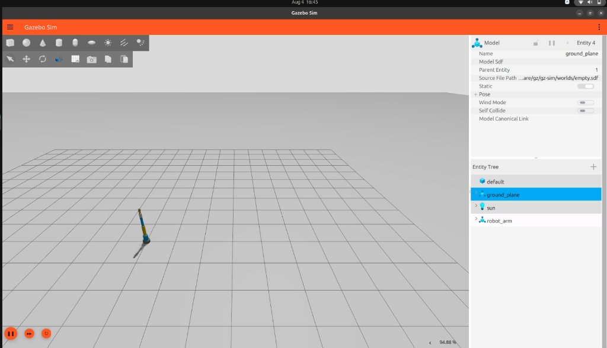

# Project 1: Robotic Arm Kinematics & Path Planning (ROS 2)

An autonomous 6-DOF Robotic Manipulator system built in **ROS 2** with Gazebo simulation, MoveIt/TF2 kinematics trajectory planning, ROS 2 control interfaces, and RViz 3D visualization.

---

## Visual Simulation Results

| RViz2 Kinematics View 1 | RViz2 Kinematics View 2 |
| :---: | :---: |
|  |  |

| Gazebo Sim Environment 1 | Gazebo Sim Environment 2 |
| :---: | :---: |
|  |  |

---

## Features

- **6-DOF Arm Model**: Complete URDF/Xacro robot description with valid visual, collision, non-zero inertia properties, and non-clamping joint limits.
- **Analytical Inverse Kinematics**: Geometric 6-DOF IK solver in `kinematics_planner_node.py` supporting target end-effector poses (`/target_pose`).
- **Gazebo Sim Integration**: Native `gz-sim-joint-state-publisher-system` plugin support for 3D physics simulation.
- **RViz2 3D Visualization**: Pre-configured `view_robot.rviz` display setup with `Fixed Frame: world`, `RobotModel`, and `TF` link frame axes (`Status: OK`).
- **Continuous 20 Hz State Publishing**: Smooth joint state update stream to prevent frame dropouts or display flickering.

---

## Repository Architecture

```text
arm_kinematics_planner/
├── package.xml
├── setup.py
├── config/
│   ├── ros2_controllers.yaml
│   └── view_robot.rviz
├── launch/
│   └── simulation.launch.py
├── media/
│   ├── rviz_pose_side.png
│   ├── rviz_pose_perspective.png
│   ├── gazebo_sim_view1.png
│   └── gazebo_sim_view2.png
├── urdf/
│   └── robot_arm.urdf.xacro
└── arm_kinematics_planner/
    ├── __init__.py
    └── kinematics_planner_node.py
```

---

## Quick Start & Execution

### 1. Build Package
```bash
cd ~/ros2_ws
source /opt/ros/lyrical/setup.bash
colcon build --symlink-install
```

### 2. Launch Simulation & RViz
```bash
source ~/ros2_ws/install/setup.bash
ros2 launch arm_kinematics_planner simulation.launch.py use_sim_time:=false
```

### 3. Send Target Goal Pose
```bash
ros2 topic pub /target_pose geometry_msgs/msg/PoseStamped "{
  header: {frame_id: 'base_link'},
  pose: {
    position: {x: 0.4, y: 0.2, z: 0.5},
    orientation: {x: 0.0, y: 0.707, z: 0.0, w: 0.707}
  }
}" --once
```

---

## Calculated IK Output
```text
[INFO] [kinematics_planner_node]: Received target pose in frame: base_link
[INFO] [kinematics_planner_node]: Computed IK Joint Angles (deg): [26.57, -1.59, 115.15, 0.0, -56.78, 0.0]
```

---

##  Maintainer
- **GitHub**: [@zakiaabdalla59-dev](https://github.com/zakiaabdalla59-dev)
- **Repository**: [DecodeLaps-Internshp](https://github.com/zakiaabdalla59-dev/DecodeLaps-Internshp)
