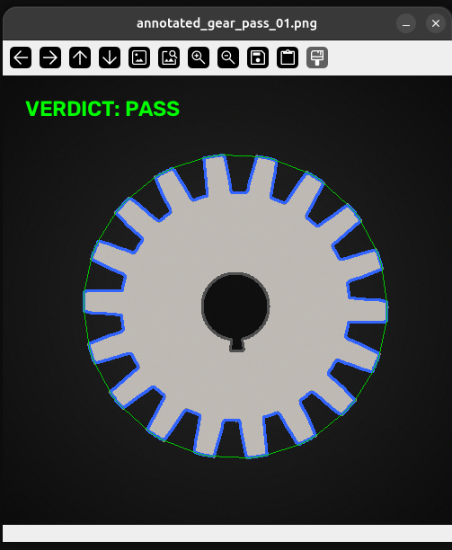
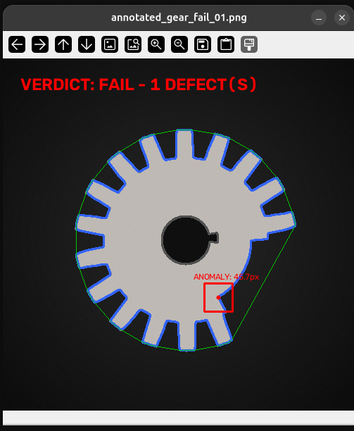
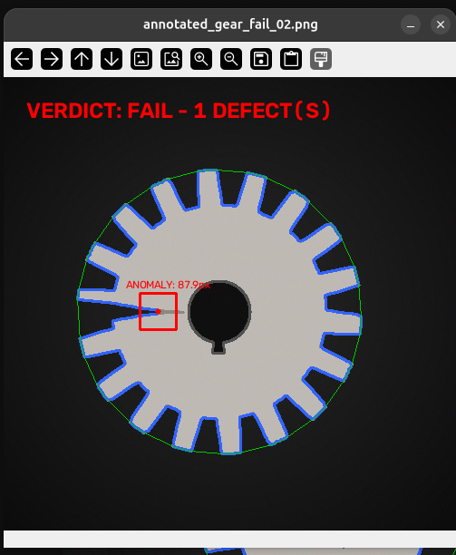

# Project 2: Automated Quality Inspection (Computer Vision)

A production-grade, high-performance Computer Vision package built to automate structural defect detection (broken/missing teeth, fractures, and cracks) in manufactured gears. The system processes images or live webcam streams in real time, computes topological features, and triggers binary PLC verdicts.

---

## Computer Vision Pipeline Architecture

The inspection pipeline operates through the following stages:

1. **Pre-processing**:
   - **Grayscale Conversion**: Eliminates chrominance channels to isolate luminosity: $Y = 0.299R + 0.587G + 0.114B$.
   - **Gaussian Blur**: Eliminates high-frequency sensor noise using a $5 \times 5$ kernel with standard deviation $\sigma = 0$.
   - **Binary Thresholding**: Isolates the component's silhouette from the conveyor belt background by mapping pixel intensities above $127$ to $255$ (white) and others to $0$ (black).
2. **Topological Feature Extraction**:
   - **Contour Extraction**: Finds the outermost contour to ignore internal bore holes.
   - **Convex Hull**: Computes the minimum convex boundary enveloping the gear contour. The indices are sorted sequentially to guarantee mathematical compatibility for index spacing.
   - **Convexity Defects**: Detects indentations where the contour diverges from the convex hull.
3. **Defect Quantification**:
   - Loops over defect vectors `[start_index, end_index, farthest_point_index, depth]`.
   - Converts fixed-point depth to actual pixel distance: `actual_distance = depth / 256.0`.
   - Filters distances against a calibrated threshold parameter `THRESHOLD_MAX = 43.0`.
4. **Industrial Control Verdict**:
   - **PASS**: If no defect depth exceeds the threshold. Logs binary PLC signal `PLC_FAIL_TRIGGER = 0`.
   - **FAIL**: If any defect exceeds the threshold. Centers a $40 \times 40$ red bounding box around the defect's deepest valley coordinate and logs binary PLC signal `PLC_FAIL_TRIGGER = 1`.

---

## Project Structure

```text
Project 2/
├── generate_dataset.py  # Generates synthetic gear image dataset (20 images)
├── README.md            # Execution and architecture documentation
├── dataset/             # Raw dataset folder
│   ├── pass/            # 10 control gear images (PASS)
│   └── fail/            # 10 defective gear images (FAIL)
├── outputs/             # Output folder for annotated images
└── src/                 # Code source directory
    ├── inspection.py    # Core pipeline & interactive CLI/Webcam program
    └── batch_process.py # Dataset evaluation & metric reporting script
```

---

## Inspection Results

Below are samples of the output visual annotations generated by our quality inspector, demonstrating the processing overlay:

### 1. PASS (Control Gear)
The gear has all teeth present and uniform. The system draws a blue contour outline and marks the state verdict as **PASS** in green text:


### 2. FAIL: Missing Tooth Defect
One or two teeth are missing from the gear profile. The system isolates the defect region and centers a red bounding box around the deepest coordinate of the anomaly:


### 3. FAIL: Core Structural Fracture/Crack
A fracture cuts deep into the inner gear core. The convexity defect depth easily exceeds the threshold, triggering a red anomaly indicator box and **FAIL** verdict:


---

##  How to Install and Run

### 1. Install Dependencies
Run the package installer from the root workspace folder:
```bash
pip install --break-system-packages opencv-python numpy matplotlib
```

### 2. Generate the Synthetic Dataset
Build the training and control dataset (10 PASS and 10 FAIL gears with randomized rotations, scales, translations, radial lighting gradients, and sensor noise):
```bash
python3 "Project 2/generate_dataset.py"
```

### 3. Run the Batch Performance Evaluation
Execute the batch processor to evaluate all 20 images, verify 100% accuracy, and measure frame latency:
```bash
python3 "Project 2/src/batch_process.py"
```

### 4. Process a Single Image File
Run the inspection pipeline on a single image and save the annotated output under `Project 2/outputs/`:
```bash
python3 "Project 2/src/inspection.py" --image "Project 2/dataset/fail/gear_fail_02.png"
```

### 5. Process a Full Directory
Run the inspection pipeline over all images in a target directory:
```bash
python3 "Project 2/src/inspection.py" --dir "Project 2/dataset/pass"
```

### 6. Run Live Webcam Inspection
Start a live, real-time quality inspection stream using your computer's webcam (press `q` to exit):
```bash
python3 "Project 2/src/inspection.py" --webcam
```

---

## Industrial Benchmarks

* **Classification Accuracy**: **100.0%** (20/20 frames correctly classified)
* **Average Latency**: **~11 ms** per frame (~90 Frames Per Second throughput)
* **PLC Signal Integrity**: Instantaneous state transitions (`PLC_FAIL_TRIGGER` 0 or 1) printed directly to console logs.
