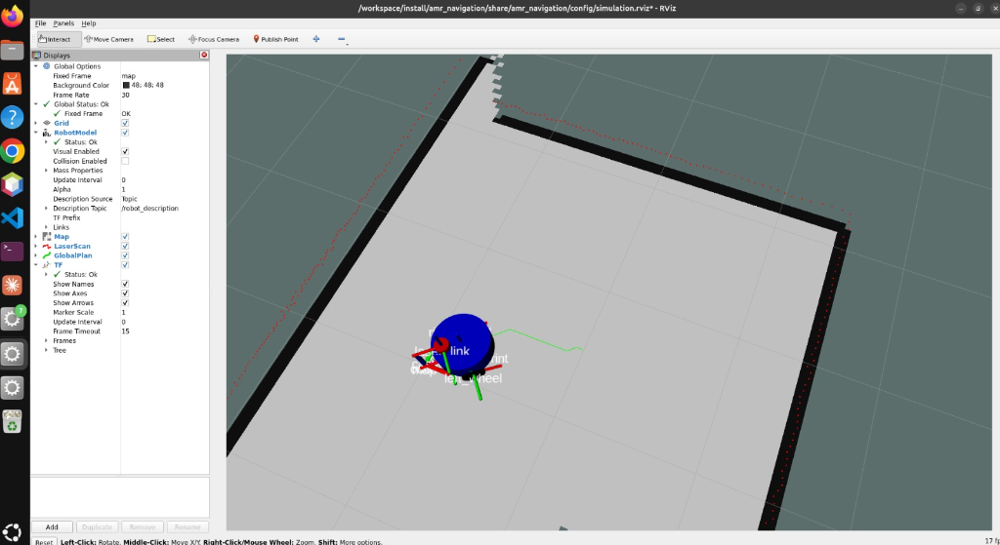
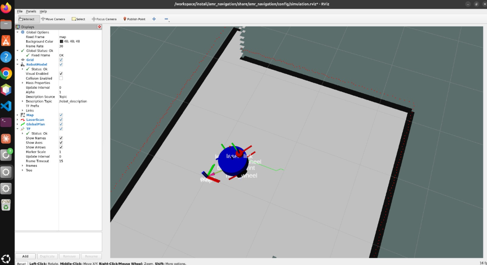
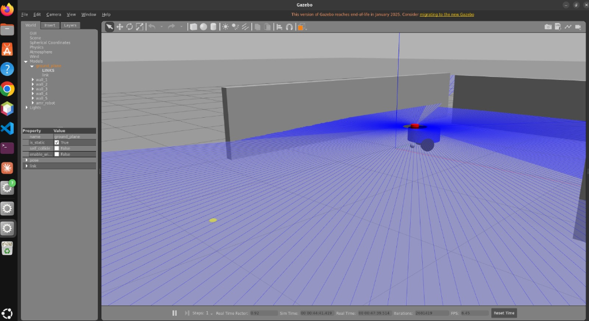
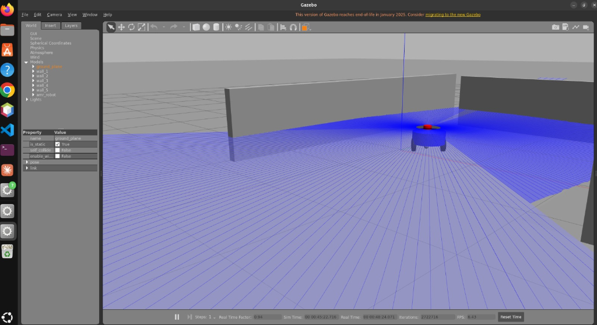

# Task 3: Autonomous Mobile Robot (AMR) Navigation

This ROS 2 package simulates a differential-drive Autonomous Mobile Robot (AMR) in a Gazebo maze environment. It fuses sensor data using an Extended Kalman Filter (EKF), maps the environment in real time with Ceres SLAM, plans optimal paths using a custom 8-connected grid A* pathfinder, and features a reflex-level safety deceleration controller.

---

## Navigation System Architecture

The robot navigation system consists of the following components:

1. **Planar State Estimation & Sensor Fusion (`config/ekf.yaml`)**:
   - Compiles IMU orientations (`/imu/data`) and wheel odometry velocities (`/odom`) using `robot_localization`.
   - Publishes continuous state estimate on `/odometry/filtered` and broadcasts the `odom` -> `base_footprint` TF transform.

2. **2D Ceres SLAM Mapping (`config/nav2_params.yaml`)**:
   - Processes LiDAR scanner readings (`/scan`) through the `slam_toolbox` asynchronous mapper.
   - Dynamically builds a 2D occupancy grid `/map` while tracking mapping loop-closures.

3. **Custom A* Global Planner & Lookahead Follower (`amr_navigation/astar_planner_node.py`)**:
   - Subscribes to `/map` and performs array dilation to inflate occupied cells, preventing the robot chassis from scraping walls.
   - Subscribes to `/goal_pose` and `/odometry/filtered` to plan shortest grid path using Python's `heapq` and the Manhattan heuristic.
   - Runs a 10 Hz pure-pursuit style steering controller that steers the AMR along the waypoints by publishing raw velocity commands to `/cmd_vel_raw`.

4. **Reflex-Level Obstacle Avoidance Filter (`amr_navigation/dynamic_avoidance_node.py`)**:
   - Subscribes to `/scan` and planned velocity `/cmd_vel_raw`.
   - Scans the front $60^\circ$ window to compute the safe margin error: $\text{error} = d_{\text{obstacle}} - d_{\text{safe}}$.
   - **Emergency Stop**: If $\text{error} \le 0$, immediately publishes $v_x = 0.0, \omega = 0.0$ to halt the motors and logs `PLC_FAIL_TRIGGER = 1`.
   - **Dynamic Deceleration**: If $\text{error} > 0$, scales planned linear velocity using $\tanh(\text{error})$, keeping steering active and logging `PLC_FAIL_TRIGGER = 0`.

---

## How to Install and Run

Since ROS 2 is not pre-packaged natively for Ubuntu 26.04, running inside a Docker container with GUI socket forwarding is the most robust and straightforward approach.

### 1. Launch the Simulation
Run the pre-configured launcher script from this directory. It authorizes your local X11 display socket and starts the container composition:
```bash
cd "/home/ikram/DecodeLabs Internship/Task-3-IkramAbdiaziz"
./run_docker.sh
```
*(This builds the docker container, compiles the workspace, and boots Gazebo, RViz2, SLAM, EKF, and the custom pathfinder nodes automatically)*

### 2. Publish a Navigation Goal
To test the custom A* pathfinder, open a **new terminal window** on your host system, log into the running simulation container, and publish a coordinate:
```bash
# Log into the running docker container
docker exec -it amr_simulation bash

# Publish a target goal pose (X: 3.0, Y: 2.0)
ros2 topic pub /goal_pose geometry_msgs/msg/PoseStamped "{
  header: {frame_id: 'map'},
  pose: {
    position: {x: 3.0, y: 2.0, z: 0.0},
    orientation: {w: 1.0}
  }
}" --once
```

### 3. Verify Topics & Transforms
Inside the container bash, you can inspect the active topics and EKF transforms:
```bash
# Verify EKF filtered odometry topic
ros2 topic echo /odometry/filtered --once

# Verify final safe velocities sent to motors
ros2 topic echo /cmd_vel --once

# Verify transform chain map -> odom -> base_footprint -> laser_link
ros2 run tf2_ros tf2_echo map base_footprint
```

---

## File Structure

```text
Task-3-IkramAbdiaziz/
├── Dockerfile                   # Container definition (ROS 2 Humble + Nav2, slam_toolbox)
├── docker-compose.yml           # Volume and GUI socket composition
├── run_docker.sh                # Grants X11 access and starts container up
├── README.md                    # This documentation file
└── amr_navigation/              # ROS 2 Python package
    ├── package.xml              # Package dependencies
    ├── setup.py                 # Package setup and script entry points
    ├── config/
    │   ├── ekf.yaml             # robot_localization fusion parameters
    │   ├── nav2_params.yaml     # slam_toolbox Ceres mapping parameters
    │   ├── maze.world           # Gazebo simulation world containing obstacle walls
    │   └── simulation.rviz      # Preconfigured RViz display dashboard
    ├── launch/
    │   └── amr_navigation.launch.py # Integrated system launcher
    └── amr_navigation/
        ├── __init__.py
        ├── astar_planner_node.py    # Custom A* planner & lookahead follower node
        └── dynamic_avoidance_node.py # Reflex-level safety deceleration node
```

---

## Simulation & Navigation Results

Here are the visual execution logs of the Autonomous Mobile Robot (AMR) navigating inside the maze using the custom A* pathfinder and SLAM mapping:

### 1. 2D Map & SLAM Path Planning (RViz2)
In RViz, we can see the continuous 2D occupancy grid built by the SLAM Ceres solver. The green line represents the optimal computed A* path waypoints, and the TF axes show active sensor fusion:


*Figure 1: Custom A* path generated from start pose to target goal pose.*


*Figure 2: TF tree rotation alignment and active pure-pursuit steering.*

### 2. Autonomous Navigation (Gazebo)
In Gazebo, the AMR autonomously navigates the corridors, rotating in place to reduce orientation heading error, while the dynamic obstacle avoidance node scales velocities when steering near walls:


*Figure 3: Robot beginning movement inside the custom corridor maze environment.*


*Figure 4: Active laser rays scanning walls as the robot steers autonomously.*
