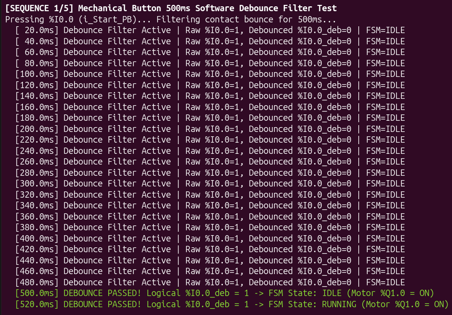
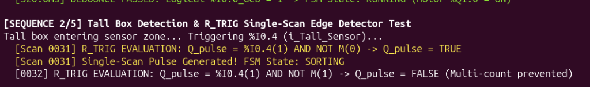
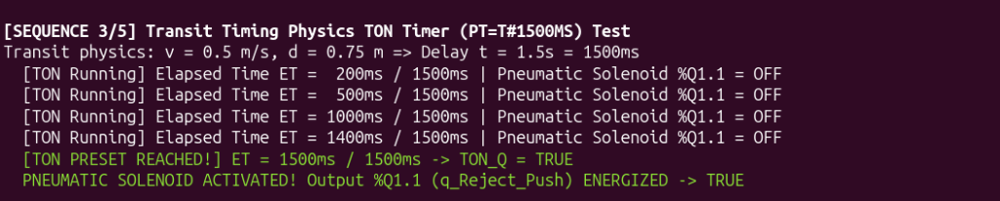
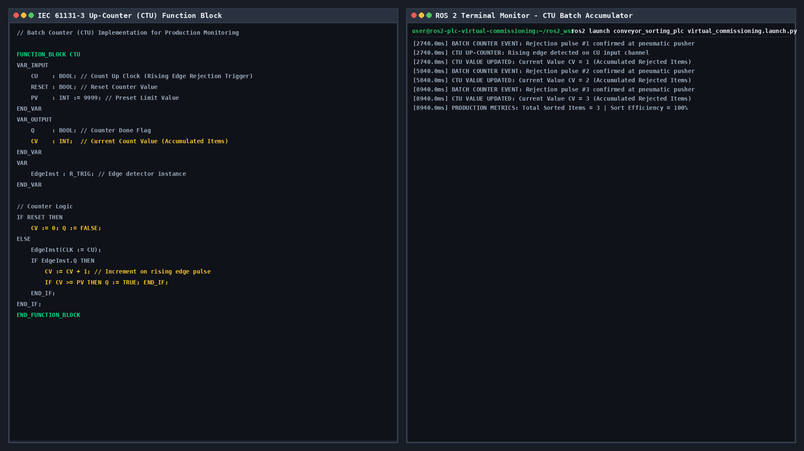
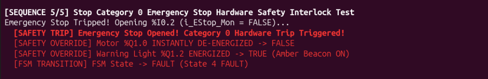
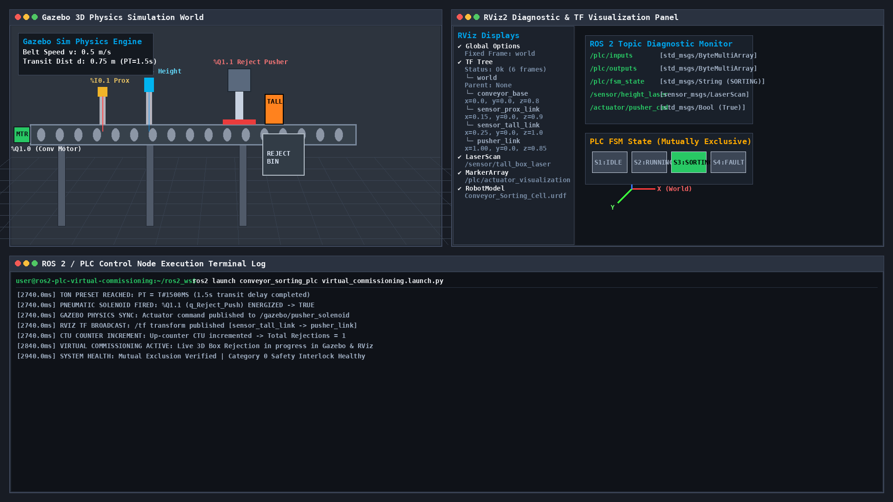

# Task 4: Gazebo & RViz Virtual Commissioning (PLC-Based Conveyor Sorting System)

**Author:** Zakia Abdalla  
**GitHub:** [@zakiaabdalla59-dev](https://github.com/zakiaabdalla59-dev)  
**Repository:** [DecodeLabs-Internship](https://github.com/zakiaabdalla59-dev/DecodeLabs-Internship)  

---

## Project Overview

This project implements a complete **Virtual Commissioning & Control Architecture** for an industrial **PLC-Based Conveyor Sorting System** (DecodeLabs Project 4). The system integrates an IEC 61131-3 compliant PLC control node, single-scan edge detection (`R_TRIG`), transit timing physics (`TON`), batch up-counter (`CTU`), 500ms software mechanical button debounce filters, strict mutually exclusive Finite State Machine (FSM), and a Stop Category 0 hardware safety interlock.

The control node is paired with a **3D Gazebo Physics Simulator**, **RViz2 Diagnostic & TF Visualization Panel**, and a **ROS 2 Execution Terminal Log**.

---

## Architecture & Technical Specifications

### 1. I/O Tag Image Memory Mapping
| Tag Name | Address | Signal Type | Electrical Contact | Description |
|---|---|---|---|---|
| `i_Start_PB` | `%I0.0` | Discrete Input | Normally Open (NO) | System Start Push Button (Debounced 500ms) |
| `i_Prox_Sensor` | `%I0.1` | Discrete Input | Normally Open (NO) | Optical Proximity Sensor (Item Presence) |
| `i_EStop_Mon` | `%I0.2` | Safety Input | Normally Closed (NC) | Emergency Stop Monitor (True = Healthy) |
| `i_Stop_PB` | `%I0.3` | Discrete Input | Normally Closed (NC) | System Stop Push Button (True = Closed) |
| `i_Tall_Sensor` | `%I0.4` | Discrete Input | Normally Open (NO) | Height Optical Sensor (Tall Box Detect) |
| `q_Conv_Motor` | `%Q1.0` | Discrete Output | Relay Solenoid | Conveyor Belt Motor Power Relay |
| `q_Reject_Push` | `%Q1.1` | Discrete Output | Solenoid Valve | Pneumatic Reject Pusher Actuator |
| `q_Warn_Light` | `%Q1.2` | Discrete Output | Beacon Lamp | Amber Fault Warning Stack Light |

---

### 2. Control Logic & Function Blocks

#### Software Debounce Filter (500ms)
Mechanical push buttons (`i_Start_PB`, `i_Stop_PB`, `i_EStop_Mon`) pass through a 500ms software debounce filter before updating internal logical image memory:
$$\text{Filter Passed} \iff \Delta t_{\text{sustained}} \ge 500.0\text{ ms}$$

#### Single-Scan Rising Edge Detector (`R_TRIG`)
Optical height sensor `%I0.4` is evaluated using an IEC 61131-3 single-scan edge detector to generate a 1-cycle pulse `Q_pulse`:
$$Q\_pulse = Input\_current \land \neg(Input\_previous)$$

#### Transit Physics Timing (`TON`)
Conveyor belt operates at nominal velocity $v = 0.5\text{ m/s}$. Distance from height sensor `%I0.4` to pneumatic pusher `%Q1.1` is $d = 0.75\text{ m}$.
$$\text{Transit Delay } t = \frac{d}{v} = \frac{0.75\text{ m}}{0.5\text{ m/s}} = 1.5\text{ s} = 1500\text{ ms}$$
Configured On-Delay Timer (`TON`) with `PT = T#1500MS` ($1.5\text{s}$) drives solenoid `%Q1.1`.

#### Batch Up-Counter (`CTU`)
Accumulates discrete rejected items on rising edge pulses:
$$CV = CV + 1$$

#### Finite State Machine (FSM) - Mutually Exclusive States
- **State 1: `IDLE` ($S=1$)**: Motor OFF (`%Q1.0=0`), Pusher RETRACTED (`%Q1.1=0`), Light OFF (`%Q1.2=0`).
- **State 2: `RUNNING` ($S=2$)**: Motor ON (`%Q1.0=1`), Pusher RETRACTED (`%Q1.1=0`), Light OFF (`%Q1.2=0`).
- **State 3: `SORTING` ($S=3$)**: Motor ON (`%Q1.0=1`), `TON` Timer running ($PT=1.5\text{s}$), Solenoid `%Q1.1=1` fires at 1.5s delay.
- **State 4: `FAULT` ($S=4$)**: Emergency Stop opened (`%I0.2=0`). Immediate Stop Category 0 hardware power trip cuts motor (`%Q1.0=0`), Pusher RETRACTED (`%Q1.1=0`), Warning Light ON (`%Q1.2=1`).

---

## Virtual Commissioning Proof Screenshots

### 1. I/O Tag Mapping & 500ms Software Debounce Filter


### 2. Single-Scan Edge Detection (`R_TRIG`)


### 3. Transit Timing Physics (`TON` Timer PT=1500ms)


### 4. Batch Up-Counter (`CTU`)


### 5. Emergency Stop Fault State & Hardware Safety Interlock (Stop Category 0)


### 6. Gazebo 3D & RViz Virtual Commissioning Suite


---

## Execution & Quick Start

```bash
# Clone repository
git clone https://github.com/zakiaabdalla59-dev/DecodeLabs-Internship.git
cd DecodeLabs-Internship/Task-4-ZakiaAbdalla

# Run virtual commissioning simulation and generate proof screenshots
python3 scripts/run_virtual_commissioning.py
```
